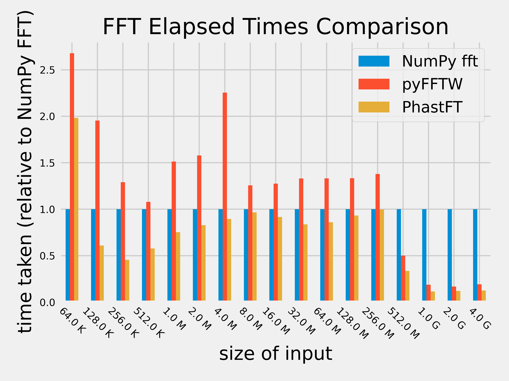
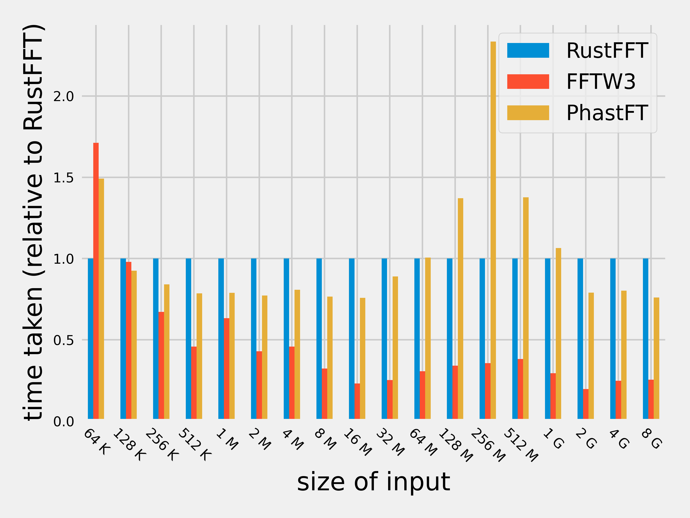

[](https://github.com/QuState/PhastFT/actions/workflows/rust.yml)
[](https://codecov.io/gh/QuState/PhastFT)

# PhastFT

PhastFT is a high-performance, "quantum-inspired" Fast Fourier
Transform (FFT) library written in pure Rust.
Despite its simplicity, its performance is competitive with FFTW.
On large inputs it outperforms even the fastest Rust FFT libraries,
including [RustFFT](https://crates.io/crates/rustfft/).

## Features

- Performance on par with FFTW and far exceeding other Rust implementations
- Simple implementation using a single, general-purpose FFT algorithm
- Zero `unsafe` code
- Takes advantage of latest CPU features up to and including AVX-512, but performs well even without them
- Optional parallelization of some steps to 2 threads (with even more planned)
- 2x lower memory usage than [RustFFT](https://crates.io/crates/rustfft/)
- Python bindings (via [PyO3](https://github.com/PyO3/pyo3))

## Limitations

- No runtime CPU feature detection (yet). Right now achieving the highest performance requires compiling
  with `-C target-cpu=native` or [`cargo multivers`](https://github.com/ronnychevalier/cargo-multivers).
- Requires nightly Rust compiler due to use of portable SIMD

## Planned features

- Runtime CPU feature detection
- More multi-threading
- More work on cache-optimal FFT

## How is it so fast?

PhastFT is designed around the capabilities and limitations of modern hardware (that is, anything made in the last 10
years or so).

The two major bottlenecks in FFT are the **CPU cycles** and **memory accesses.**

We picked an efficient, general-purpose FFT algorithm. Our implementation can make use of latest CPU features such as
AVX-512, but performs well even without them.

Our key insight for speeding up memory accesses is that FFT is equivalent to applying gates to all qubits in `[0, n)`.
This creates to oppurtunity to leverage the same memory access patterns as
a [high-performance quantum state simulator](https://github.com/QuState/spinoza).

We also use the Cache-Optimal Bit Reveral
Algorithm ([COBRA](https://csaws.cs.technion.ac.il/~itai/Courses/Cache/bit.pdf))
on large datasets and optionally run it on 2 parallel threads, accelerating it even further.

All of this combined results in a fast and efficient FFT implementation that surpasses the performance of existing Rust
FFT crates,
including [RustFFT](https://crates.io/crates/rustfft/) on large inputs and while using significantly
less memory.

## Quickstart

### Rust

```rust
fn main() {
    let N = 1 << 10;
    let mut reals = vec![0.0; N];
    let mut imags = vec![0.0; N];
    gen_random_signal(&mut reals, &mut imags);

    fft_dif(&mut reals, &mut imags);
}
```

### Python

Follow the instructions at https://rustup.rs/ to install Rust, then switch to the nightly channel with

```bash
rustup default nightly
```

Then you can install PhastFT itself:

```bash
pip install numpy
RUSTFLAGS='-Ctarget-cpu=native' pip install git+https://github.com/QuState/PhastFT#subdirectory=pybindings
```

```python
import numpy as np
from pybindings import fft

sig_re = np.asarray(sig_re, dtype=np.float64)
sig_im = np.asarray(sig_im, dtype=np.float64)

fft(a_re, a_im)
```

## Benchmarks

PhastFT is benchmarked against several other FFT libraries. Scripts and instructions to reproduce benchmark results and
plots are available [here](benches).

<p align="center">
  
  
</p>

## Contributing

Contributions to PhastFT are welcome! If you find any issues or have improvements to suggest, please open an issue or
submit a pull request. Follow the contribution guidelines outlined in the CONTRIBUTING.md file.

## License

PhastFT is licensed under MIT or Apache 2.0 license, at your option.

## PhastFT vs RustFFT

[RustFFT](https://crates.io/crates/rustfft/) is another excellent FFT implementation in pure Rust.
RustFFT and PhastFT are optimized for different workloads.

RustFFT performs best on small inputs that fit entirely into the L2 cache,
while PhastFT is optimized for large input sizes common in scientific computing.

PhastFT also uses 2x less memory, which is important for processing large datasets.

RustFFT made the choice to work on stable Rust compiler at the cost of `unsafe` code,
while PhastFT contains no `unsafe` blocks but requires a nightly build of Rust compiler
to access the Portable SIMD API.

## What's with the name?

The name, **PhastFT**, is derived from the implementation of the
[Quantum Fourier Transform](https://en.wikipedia.org/wiki/Quantum_Fourier_transform) (QFT). Namely, the
[quantum circuit implementation of QFT](https://en.wikipedia.org/wiki/Quantum_Fourier_transform#Circuit_implementation)
consists of the **P**hase gates and **H**adamard gates. Hence, **Ph**astFT.
